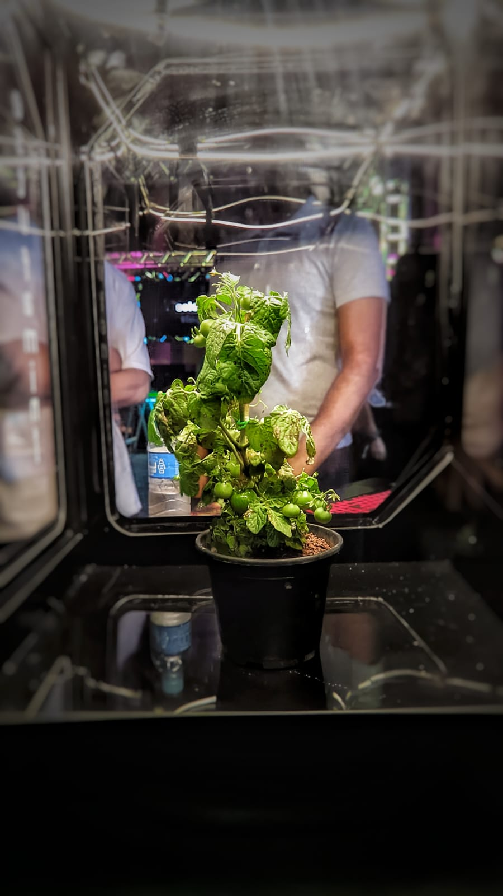
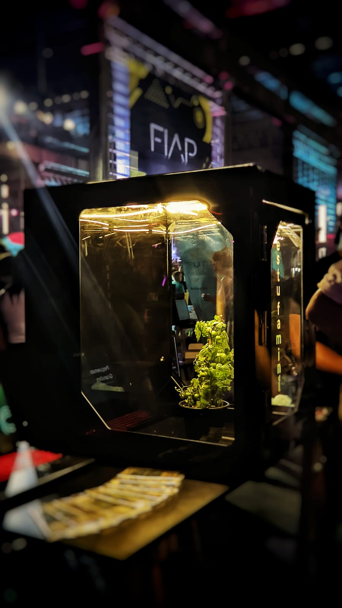

<a name="API"></a>

<br />
<div align="center">
  <a href="#">
    
  </a>
</div>

## Sobre o projeto
<div style="display: flex; justify-content: space-between;">
    
    
</div>
<div>
<p>Este é o projeto de circuito arduino controlador/sensoriamento da estufa mini.<br>
</p>

<a href="https://www.youtube.com/watch?v=2G21JCTjJ8I">Acesse o vídeo contento a explicação sobre o mundo de IoT </a>
<p>Areas que o circuito arduino afeta: <br>
* <a href="https://github.com/FIAP-grupo-challenge/Python_GS" >API</a> : Elemento que vai carregar essas informações (python).<br>
* <a href="https://github.com/FIAP-grupo-challenge/Python_algoritimo_assincrono_GS" >Algoritimo Assincrono</a> : Elemento que vai processar essas informações (python).<br>
* Banco de dados : indiretamente pela API (consultar README.md da <a href="https://github.com/FIAP-grupo-challenge/Python_GS" >API</a> ou <a href="https://github.com/FIAP-grupo-challenge/Python_algoritimo_assincrono_GS" >Algoritimo Assincrono</a> para mais informações).<br>
</p>
</div>
<div align="center">
</div>

# Circuitos
## circuito principal de controlador/sensoriamento
<div align="center">

</div>

## componentes
1. DHT11 (representação)
    <div >
    
    </div>

    Função: Capturar niveis de humidade e temperatura do ambiente.

2. LDR 
    <div >
    
    </div>
    Função: Capturar nivel de luz do ambiente.
3. PH
    <div >
    
    </div>
    Função: Capturar nivel de PH do solo ambiente.
4. Servo Motor
    <div >
    
    </div>
    Função: Abrir a porta de ventilação da estufa para controle de temperatura.
5. Motor CC
    <div >
    
    </div>
    Função: Girar a ventuinha de refrigeração da estufa para controle de temperatura

## codigo
```c
#include <DHT.h>
#include <ArduinoJson.h>

const int potPin = A0;
#define MOTOR_PIN 9 
#define DHTPIN 4     // Define a porta digital 4 como a porta de dados do sensor
#define DHTTYPE DHT11 // Define o tipo de sensor como DHT11
const int ldrPin = A1; // Pino A1 como entrada analógica para o sensor LDR
DynamicJsonDocument doc(1024);


DHT dht(DHTPIN, DHTTYPE); // Inicializa o objeto DHT

void setup() {
  pinMode(MOTOR_PIN, OUTPUT);
  int ldrValue = analogRead(ldrPin); // Lê o valor analógico do sensor LDR
  Serial.begin(9600); // Inicializa a comunicação serial com a taxa de baud 9600
  dht.begin();        // Inicializa o sensor DHT
}

void loop() {
  delay(2000); // Aguarda 2 segundos para evitar leituras frequentes
  String data_JSON;

  float valph =  analogRead(potPin);
  float ph = (valph / 73.00) - 7;


  // le a quantidade de luz do ambiente
  int ldrValue = analogRead(ldrPin); // Lê o valor analógico do sensor LDR

  // Lê a umidade relativa
  float humidity = dht.readHumidity();

  // Lê a temperatura em graus Celsius
  float temperature = dht.readTemperature();

  // Verifica se a leitura do sensor foi bem-sucedida
  if (isnan(humidity) || isnan(temperature)) {
    Serial.println("Erro ao ler o sensor DHT!");
  } else {
    // Exibe os dados no monitor serial
    doc["humi"] = humidity;
    doc["temp"] = temperature;
    doc["light"] = ldrValue * 15;
    doc["ph"] = ph;
    doc["plant_id"] = 1;
    if (temperature > 26) {
      // Liga o motor DC
      digitalWrite(MOTOR_PIN, HIGH);
    } else {
      // Desliga o motor DC
      digitalWrite(MOTOR_PIN, LOW);
    }
  serializeJson(doc, data_JSON);
  Serial.println(data_JSON);
  }
  delay(1000);
}
```
## Proposito

Esse circuito tem como proposito principal o sensoriamento do ambiente da planta, isto é, capturar informações sobre a temperatura do ambiente, humidade relativa, nivel de iluminação e PH do solo. O processo de encaminhamento destes dados para a api sera realizado por um script de Python com a biblioteca <a href="https://pypi.org/project/pyserial/" >Pyserial</a>.
<br>
O segundo proposito secundario deste circuito é realizar tarefas de controle da estufa, como porta/ventuinha de ventilação

## Circuito de alimentação da ventoinha


## Circuiuto de alimentação dos LEDs


## Circuito de controle secundario
<div align="center">

</div>
Devido a um problema a ausencia da biblioteca time na plataforma tinkercad este cricuito não pode ser simulado


## Proposito


Este circuito ira agir de acordo com a tabela de tempos estabalecida na biblioteca time, fazendo com que a planta seja regada em intervalos regulares utilizado a <a href="https://www.emerson.com/en-us/automation/fluid-control-pneumatics/solenoid-valves#:~:text=A%20solenoid%20valve%20is%20a,field%20that%20moves%20a%20plunger.">válvula solenoide</a> (valvula com interface eletrica).


## Integração


Esse circuito sera integrado ao nosso sistema da mini estufa via node-red <br>
e protocolo https para enviar as informações diretamente para nossa <a href="https://github.com/FIAP-grupo-challenge/Python_GS" >API proprietaria</a>


## Arquitetura


Neste projeto utilizamos Arquitetura Cliente-Servidor:  Neste modelo, os dispositivos IoT (clientes) se comunicam com servidores na nuvem. Os dispositivos coletam dados e os enviam para os servidores, que processam e armazenam os dados. Os aplicativos e serviços acessam os dados por meio dos servidores. Isso permite uma maior capacidade de processamento na nuvem e uma fácil escalabilidade.


# Desenvolvedores
1. Nome: Lucas Fernandes Joaquim, RM: 551313
2. Nome: Gustavo Ferreira Lopes, RM: 98887
3. Nome: heitor freire dos anjos, RM: 552165
4. Nome: Rodrigo Fernandes dos Santos, RM: 98896
5. Nome: Enzo Silva Cataldi, RM: 99826
